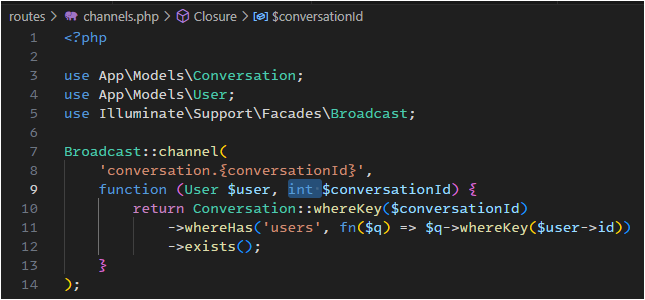
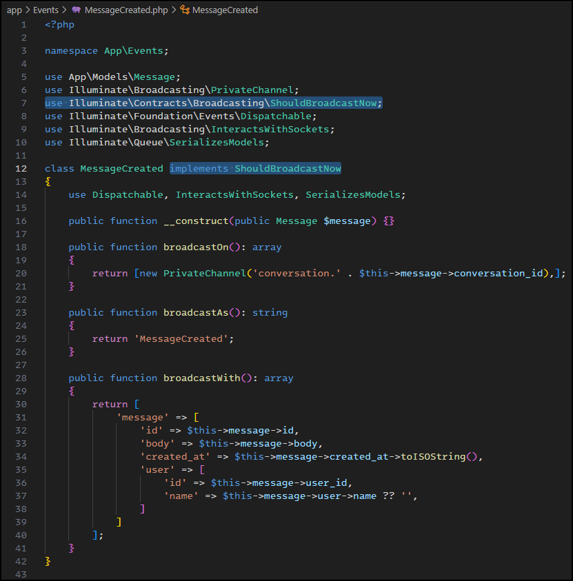
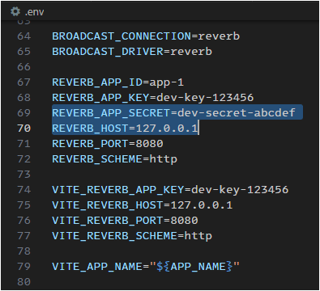
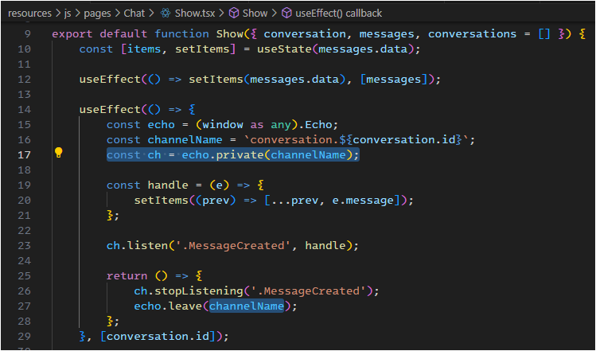
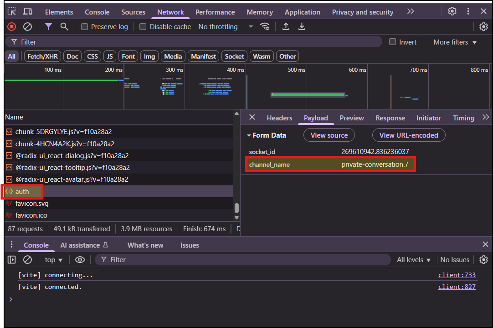
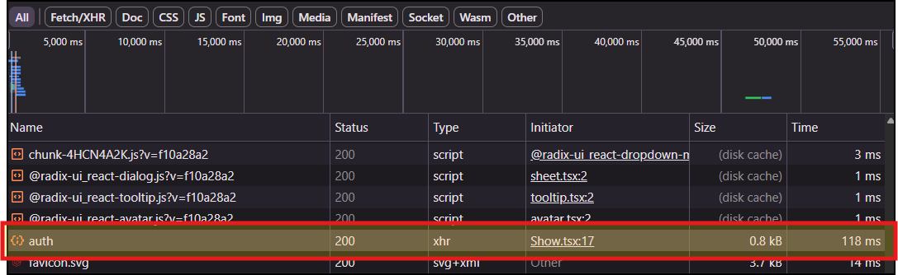

# FIX-REALTIME-CHAT.md

*Hướng dẫn sửa lỗi realtime (403 `/broadcasting/auth`, không nhận tin cho tới khi refresh)*

## 1) Sửa `routes/channels.php`

**Mục đích:** Hàm authorize của private channel phải nhận **ID** (int) và trả boolean; nếu type-hint model sai sẽ luôn trả `false` => 403.

*Sửa lại routes\channels.php `Conversation $conversationId` thành `int $conversationId`*



---

## 2) Sửa `app/Events/MessageCreated.php`

**Mục đích:** Đảm bảo event được phát ngay lập tức về private channel của conversation.

**Thêm interface**: `ShouldBroadcastNow`



---

## 3) Cập nhật `.env`

**Mục đích:** Sai tên key và value



---

## 4) Chỉnh lại Client Echo subscribe resources\js\pages\Chat\Show.tsx
Xóa dòng 

```tsx
const privateName = `private-${channelName}`;
```

lấy biến channelName làm tên chính cho channel luôn:
    


## Lệnh cần chạy sau khi chỉnh sửa

```bash
php artisan optimize:clear
php artisan config:clear
```

Khởi động Reverb (đã cấu hình chung với script: dev trong composer.json rồi):

Nên không cần chạy
```bash
php artisan reverb:start
```

Mà chạy luôn
```bash
composer run dev
```

---

## Kiểm tra browser

1. Mở DevTools → **Network** khi trang chat load:

   * Request `POST /broadcasting/auth` phải trả **200**.
   * **Payload** phải có `channel_name = private-conversation.{ID}`.
   
   

2. Gửi tin nhắn:

   * Tin nhắn hiện ngay lập tức ở cả 2 phía, không cần refresh.

---
